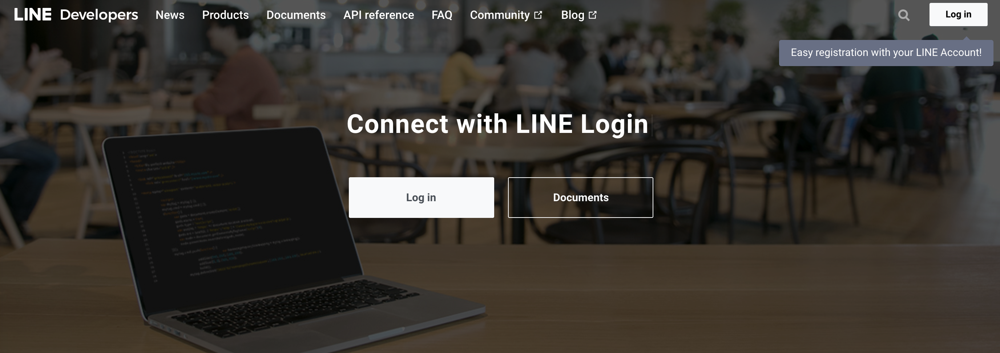
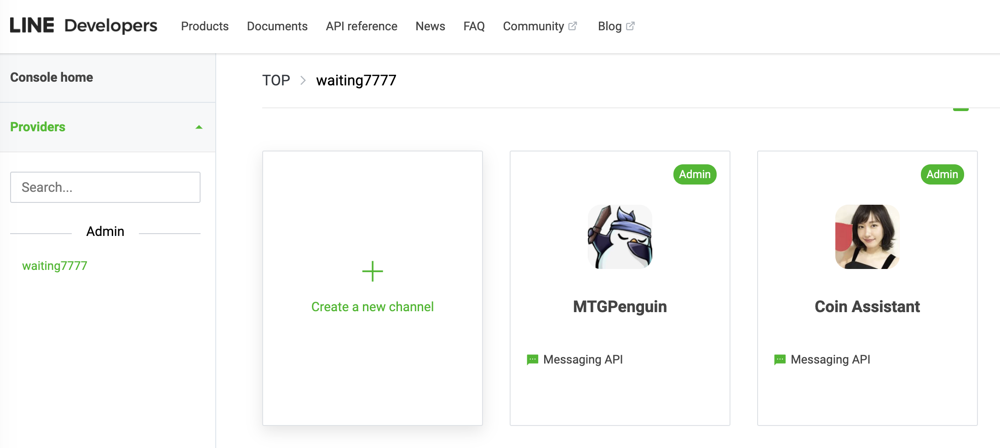
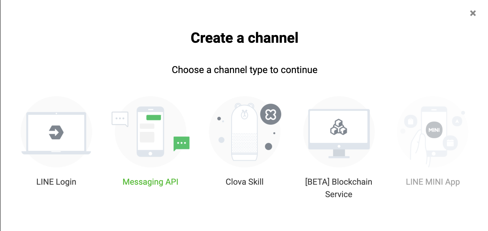
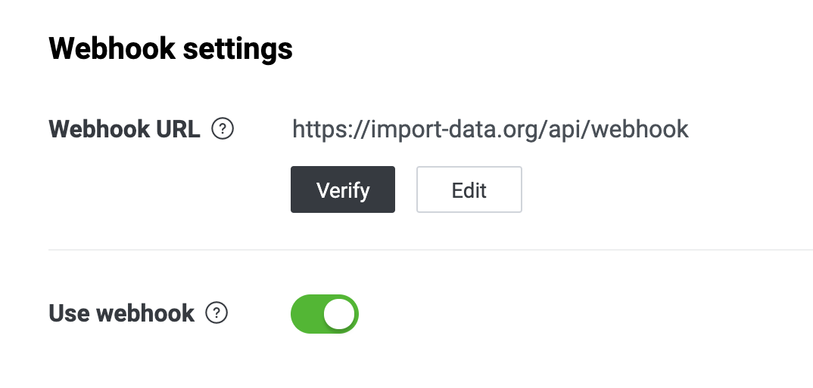
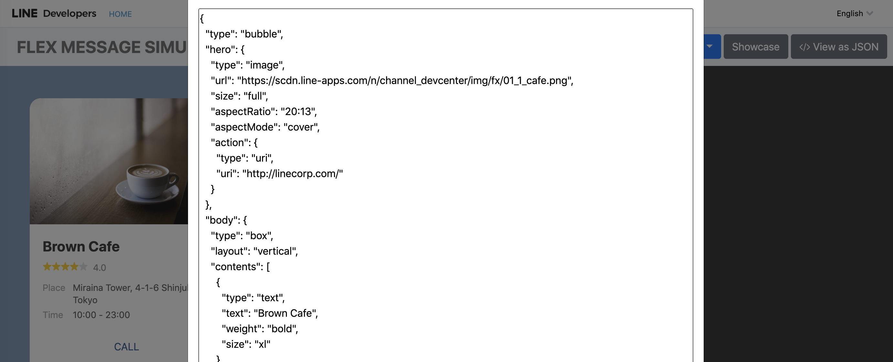
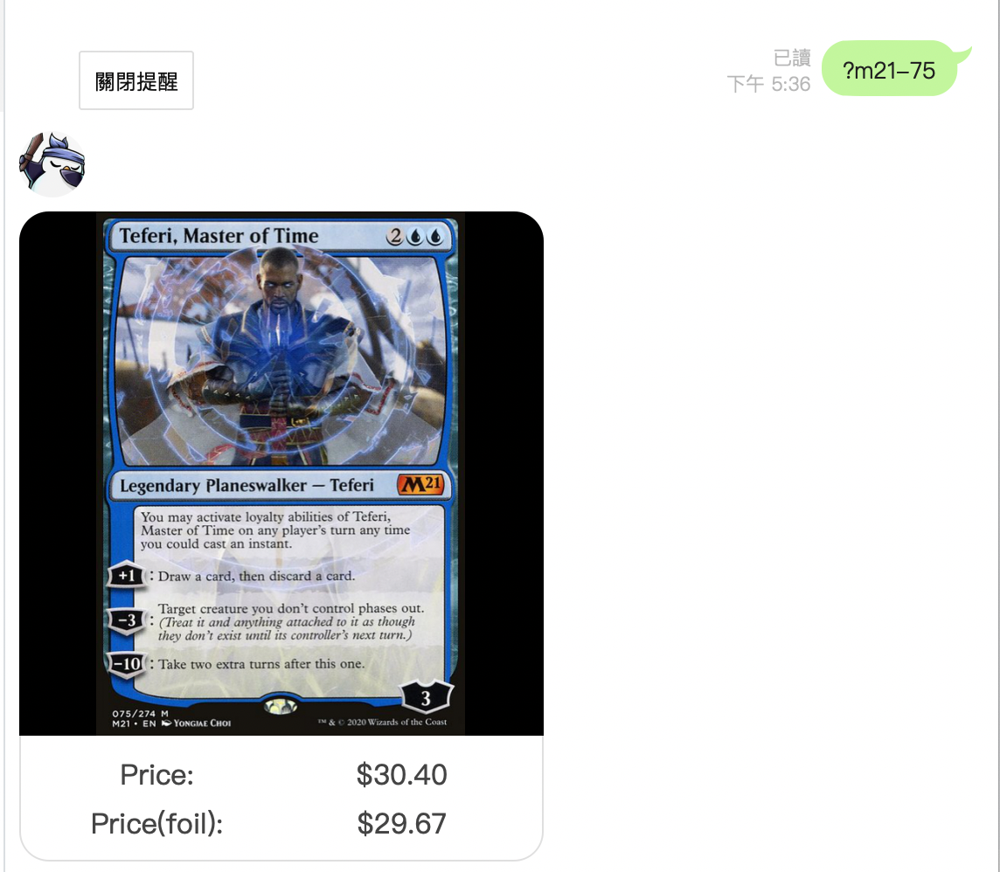

## Line Chatbot 聊天機器人

首先先到 [https://developers.line.biz/en/](https://developers.line.biz/en/) 登入你的 Line ID，



然後到這邊選擇 **Create a new channel** 建立一個新的 message api 頻道(機器人)





建立完成之後，填上基本資訊(敘述，圖片...等等)，接著最重要的就是 **Channel access token** 跟 **Channel secret** ，基本上所有機器人行為，都要靠這兩個來打 API 完成。

然後到 **Messaging API** 分頁設定 webhook，webhook 的意思就是讓我們的系統去訂閱我們建立的這個 channel 的事件，換句話說就是之後你這頻道有人加好友、刪好友、對話...等等，都會產生相對應的 **Webhook event** 到我們設定的網址，所以必須要建立一個 server 並且打開相對應的 api 路徑，這樣 line 只要有相對應的事件發生，就會打 api 到設定好的 webhook。



## 實際開發

因為只是個練手的機器人，所以決定把它的接口，直接接在之前的一個 NuxtJS 專案裡面，當初 NuxtJS 專案建立的時候，選擇了 `express` server，用一個 post 來接 `webhook`，並且用官方提供的 `@line/bot-sdk` SDK 當 middleware，並且根據[文件](https://line.github.io/line-bot-sdk-nodejs/getting-started/basic-usage.html#synopsis)修改至我們的 NuxtJS server 裡面。

```
const line = require('@line/bot-sdk')

const config = {
  channelAccessToken: 'YOUR_CHANNEL_ACCESS_TOKEN',
  channelSecret: 'YOUR_CHANNEL_SECRET'
}

const client = new line.Client(config)

router.post('/api/webhook', line.middleware(config), async (req, res, next) => {
  console.log(req.body)
  req.body.events.map(event => {
    messageHandle(event)
  })
  res.sendStatus(200);
})
```

從 code 裡面就可以看到，每當我們的 channel 收到 event 時，就會同時發到我們的 webhook，那 event 的格式就要參考官方的[文件](https://developers.line.biz/en/reference/messaging-api/#webhook-event-objects)，當 event 來時 `messageHandle` 會去處理。

## MTG 查牌機器人

這次我們的目標是想要串一個`魔法風雲會`的查牌機器人，想要輸入指令就在 Line 裡面顯示`魔法風雲會`的卡片，而不用打開網頁查，那我們要串的網站是 [https://scryfall.com/](https://scryfall.com/) ，這是一個很詳細的`魔法風雲會`卡片資料庫，而且有提供 api 使用。

那麼就來設計指令，我們這邊想要用的指令是 `?{系列}-{卡號}` 用這格式來列出某系列某卡號的卡片以及他的價格，那麼首先 `messageHandle` 就要先解析文字，然後抓出想查的系列跟卡號再帶到 scryfall 的 api，最後再把查詢結果用 `reply message` 發送回來。

```
async function messageHandle(event) {
  switch(event.type) {
    case 'message':
      // 檢查第一個字元是否為問號，且帶有 '-‘當作觸發機器人的條件
      if ((text[0] == '?') && text.includes('-')) {
        const temp = text.slice(1).split('-')
        const set = temp[0]
        const number = parseInt(temp[1])
        // 將字串分割取出 set 跟 number，因為魔法風雲會 系列代碼必為 3~4 碼，這別增加檢查減輕 server 負擔
        if (set.length == 3 || set.length == 4 && number !== NaN) {
          const res = await axios.get(`https://api.scryfall.com/cards/${set.toLowerCase()}/${number}`)
          const data = res.data
          const replyJson = formatCardReply(data)
          client.replyMessage(event.replyToken, {
            type: 'flex',
            altText: data.name,
            contents: replyJson
          })
          .then(res => console.log(res))
          .catch(e => console.log(e.originalError.response.data.details))
      }
  }
}
```

## Flex Message Type

有了會收 event 的 webhook，有會處理 event 的 handler，那麼要怎樣回覆一篇潮潮的訊息呢，Line 有一種訊息類別叫做 **Flex**，可以有複雜的訊息 UI，但要單純憑空想像還蠻困難的，所以這邊要借助 Line 官方的[Flex Simulator](https://developers.line.biz/flex-simulator/)，把你拿到的資料並且在上面弄出範例並且用 `</> View as JSON` 來觀察訊息的格式，這樣就能了解自己這邊 handler 要把訊息處理成啥模樣。



而我們當初想要把卡片的圖片顯示出來，並且把卡價列在下面，所以我的卡片 Flex 回覆長這樣：
```
function formatCardReply(data) {
  const temp = {
    "type": "bubble",
    "body": {
      "type": "box",
      "layout": "vertical",
      "contents": [
        {
          "type": "image",
          "url": data.image_uris.border_crop,
          "size": "full",
          "aspectMode": "fit"
        }
      ],
      "paddingAll": "0px",
      "backgroundColor": "#000000"
    },
    "footer": {
      "type": "box",
      "layout": "vertical",
      "spacing": "sm",
      "contents": [
        {
          "type": "box",
          "layout": "horizontal",
          "contents": [
            {
              "type": "text",
              "text": "Price:",
              "align": "center"
            },
            {
              "type": "text",
              "text": `$${data.prices.usd}`,
              "align": "center"
            }
          ]
        },
        {
          "type": "box",
          "layout": "horizontal",
          "contents": [
            {
              "type": "text",
              "text": "Price(foil):",
              "align": "center"
            },
            {
              "type": "text",
              "text": `$${data.prices.usd_foil}`,
              "align": "center"
            }
          ]
        }
      ],
      "flex": 0
    }
  }
  return temp
}
```

實際的結果如下圖：



如此一來`魔法風雲會`的查價機器人就已經完成了，輸入`?{系列}-{卡號}`會去 scryfall 網站拿取卡片圖片以及卡價，最後回覆在頻道裡。

## 結論

隨著手機的普及，現在做網站一定要有手機版，但對於手機用戶來說，輸入網址實在是很困難的一件事情，而手機上面黏著度最高的 app 就是社交 app，像是 Facebook、Instagram 以及聊天 app Line、Wechat 等等，而聊天機器人就是這麼應運而生的，在訊息介面裡面輸入指令，就能直接拿到網站的結果，這樣就能完全跳離網站的控制(這也是各大聊天 app 開發機器人 api 的目的)，但隨著時代演進這就是不可逆的潮流，不只 Line，Facebook Messager、Slack、Discord 等等也都有機器人 api，本篇藉由從創立 channel 開始，簡單介紹 webhook 的串接，以及對接網站的 api 當範例，來完成`魔法風雲會`的卡片查卡價機器人。

下圖為頻道的 **QRCODE**，有興趣的可以點來玩玩，有任何互動提議或意見也歡迎交流😁

